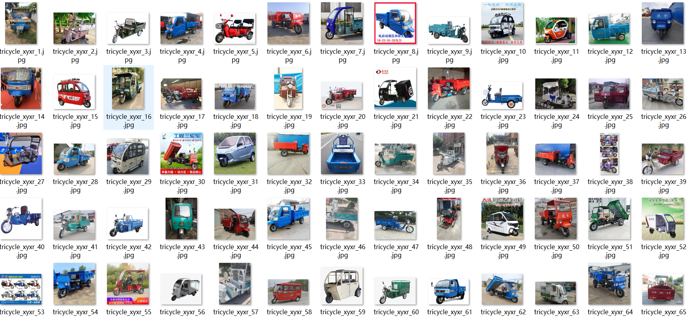
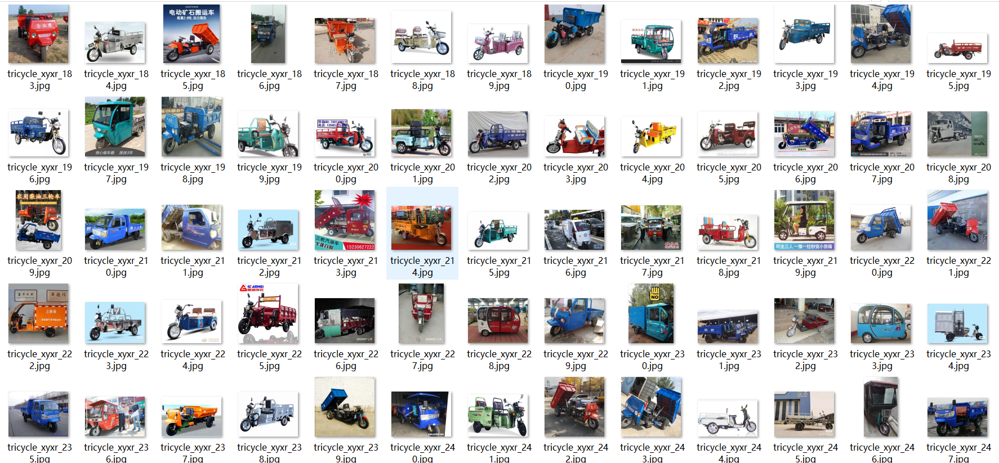

# [Object Detection Dataset] Tricycle Dataset 559 imagesVOC+YOLO format

Dataset Description: ~

Three-Wheeler Dataset: 559 VOC+YOLO format (manual annotations)

Dataset format: Pascal VOC format + YOLO format (the txt file does not contain the split path, it only contains jpg images and corresponding VOC format xml files and yolo format txt files)

Number of images (number of jpg files): 559

Number of annotations (number of xml files): 559

Number of annotations (number of txt files): 559

Number of categories: 1

Callout category name: ["tricycle"]

Number of boxes labeled in each category:

tricycle frame count = 659

Total boxes: 659

Use the labeling tool: labelImg

Rules for annotation: Draw a rectangle around the category.

Important Note: None

Special Notice: This dataset does not guarantee the accuracy or precision of the trained models or weight files. The dataset only provides accurate and reasonable annotations.

## Images

---

Here is a pay link on Stripe (https://buy.stripe.com/3cs8yP7sY87d0vu9AB). Please contact me lonlonago@foxmail.com after funding $89, and I will send you a complete data files, thank you!

